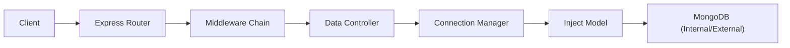

# Dynamic Connection Manager — Full Request Flow

> [!NOTE]
> This diagram traces the **complete under-the-hood flow** when a client sends a GET or POST request to a project's collection endpoint (e.g. `POST /api/data/posts` or `GET /api/data/posts`).

---

## High-Level Architecture



---

## Detailed Sequence Diagram

```mermaid
sequenceDiagram
    autonumber
    participant Client
    participant Router as Express Router<br/>(data.js)
    participant VAK as verifyApiKey
    participant BUC as blockUsersCollection
    participant UG as usageGate<br/>(checkUsageLimits)
    participant RAC as resolvePublicAuthContext
    participant AUTH as authorizeRead/WriteOp
    participant DC as Data Controller<br/>(insertData / getAllData)
    participant CM as Connection Manager<br/>(getConnection)
    participant REG as Registry<br/>(In-Memory Map)
    participant Redis as Redis Cache
    participant MainDB as Main MongoDB<br/>(Project collection)
    participant ENC as Encryption Util<br/>(decrypt)
    participant MNG as mongoose.createConnection
    participant IM as injectModel<br/>(getCompiledModel)
    participant MREG as Model Registry<br/>(WeakMap)
    participant ExtDB as Target MongoDB<br/>(Internal or External)
    participant GC as Garbage Collector

    Note over Client,Router: ━━━ PHASE 1: REQUEST ARRIVES ━━━

    Client->>Router: HTTP Request<br/>POST /api/data/posts<br/>Headers: x-api-key, Authorization

    Note over Router,VAK: ━━━ PHASE 2: MIDDLEWARE CHAIN ━━━

    Router->>VAK: ① verifyApiKey(req, res, next)
    
    Note right of VAK: Extract API key from<br/>x-api-key header or<br/>?key= query param
    
    Note right of VAK: If publishable key: check cache with raw key first,<br/>fallback to hashed key.<br/>If secret key: check cache with hashed key directly.
    VAK->>Redis: Check project cache (getProjectByApiKeyCache)
    
    alt Cache HIT
        Redis-->>VAK: Cached project config
    else Cache MISS
        VAK->>MainDB: Project.findOne({ publishableKey/secretKey })<br/>.select("name owner resources collections<br/>databaseLimit jwtSecret allowedDomains...")
        MainDB-->>VAK: project document
        VAK->>Redis: setProjectByApiKeyCache(key, project)
    end

    Note right of VAK: ✅ Validate: owner.isVerified<br/>✅ CORS: allowedDomains check<br/>✅ Set req.project, req.keyRole

    VAK-->>Router: next()

    Router->>BUC: ② blockUsersCollectionDataAccess
    Note right of BUC: Block if collectionName === "users"<br/>(Must use /api/userAuth/* instead)
    BUC-->>Router: next()

    Router->>UG: ③ checkUsageLimits
    Note right of UG: Resolve developer plan via<br/>Redis cache → Developer.findById<br/>Check per-minute rate limit<br/>Check daily request limit
    UG->>Redis: INCR project:usage:min:{id}:{minute}
    UG->>Redis: INCR project:usage:req:count:{id}:{day}
    UG-->>Router: next()

    Router->>RAC: ④ resolvePublicAuthContext
    Note right of RAC: If publishable key:<br/>  Extract Bearer token<br/>  jwt.verify(token, project.jwtSecret)<br/>  Set req.authUser = { userId, claims }<br/>If secret key: skip
    RAC-->>Router: next()

    Router->>AUTH: ⑤ authorizeRead or WriteOperation

    alt GET Request (Read)
        Note right of AUTH: If secret key → bypass (no filter)<br/>If RLS disabled → no filter<br/>If RLS mode = "public-read" → no filter<br/>If RLS mode = "private" → filter by ownerField
        AUTH-->>Router: next() with req.rlsFilter set
    else POST Request (Write)
        Note right of AUTH: Secret-key writes bypass authorization immediately.<br/>Bearer-token and ownership checks apply only to publishable-key writes.<br/>Auto-inject ownerField (from collection RLS config) rather than always userId.<br/>Validate ownership on each item.
        AUTH-->>Router: next()
    end

    Note over DC,ExtDB: ━━━ PHASE 3: CONTROLLER + CONNECTION MANAGER ━━━

    Router->>DC: ⑥ insertData(req, res) or getAllData(req, res)
    
    Note right of DC: Find collectionConfig from<br/>req.project.collections<br/>Validate incoming data (POST)

    DC->>CM: getConnection(project._id)

    Note over CM,MNG: ━━━ 3-TIER CONNECTION RESOLUTION ━━━

    rect rgb(40, 40, 60)
        Note over CM,REG: TIER 1: In-Memory Registry (Fastest)
        CM->>REG: registry.has(projectId)?
        alt Cache HIT & readyState === 1
            REG-->>CM: ✅ Return cached connection
            Note right of CM: Update lastAccessed timestamp
        else Cache MISS or connection dead
            Note right of CM: Fall through to Tier 2...
        end
    end

    rect rgb(40, 50, 40)
        Note over CM,Redis: TIER 2: Redis URI Cache (Saves DB + Decrypt)
        CM->>Redis: GET project:uri:{projectId}
        alt Redis HIT
            Redis-->>CM: { dbUri, plan } (JSON)
            Note right of CM: Parse and use dbUri
        else Redis MISS
            Note right of CM: Fall through to Tier 3...
        end
    end

    rect rgb(60, 40, 40)
        Note over CM,MainDB: TIER 3: Database Lookup + Decryption
        CM->>MainDB: Project.findById(projectId)<br/>.select("+resources.db.config.encrypted<br/>+resources.db.config.iv +resources.db.config.tag<br/>resources.db.isExternal plan")
        MainDB-->>CM: project document

        alt isExternal === false (Internal DB)
            CM-->>DC: Return mongoose.connection<br/>(shared main DB connection)
            Note right of CM: ⚡ Short-circuit!<br/>No new connection needed
        else isExternal === true (External DB)
            CM->>ENC: decrypt(project.resources.db.config)
            ENC-->>CM: Decrypted JSON → { dbUri }
            CM->>Redis: SET project:uri:{id} {dbUri, plan}<br/>EX 3600 (1 hour TTL)
        end
    end

    Note over CM,MNG: ━━━ NEW CONNECTION CREATION (External DB only) ━━━

    CM->>MNG: mongoose.createConnection(dbUri, options)
    
    Note right of MNG: Connection Options:<br/>━━━━━━━━━━━━━━━━━━<br/>maxPoolSize: 50 (premium) / 15 (free)<br/>minPoolSize: 2 (warm sockets)<br/>maxIdleTimeMS: 15,000ms<br/>connectTimeoutMS: 5,000ms<br/>socketTimeoutMS: 45,000ms<br/>waitQueueTimeoutMS: 5,000ms

    MNG->>ExtDB: TCP/TLS Handshake + Auth
    
    alt Connection SUCCESS
        ExtDB-->>MNG: ✅ Connected
        MNG-->>CM: connection object
        CM->>REG: registry.set(projectId, connection)
        Note right of CM: Set connection.lastAccessed = now<br/>Register error/disconnect/close handlers<br/>→ auto-cleanup from registry on failure
    else Connection FAILED (Timeout)
        CM->>CM: getPublicIp()
        CM-->>DC: ❌ Error: "Whitelist Server IP [x.x.x.x]<br/>in MongoDB Atlas"
    end

    CM-->>DC: Return connection

    Note over DC,MREG: ━━━ PHASE 4: MODEL COMPILATION ━━━

    DC->>IM: getCompiledModel(connection, collectionConfig, projectId, isExternal)

    rect rgb(50, 40, 50)
        IM->>MREG: WeakMap lookup: modelRegistry.get(connection)
        
        alt Model Already Compiled
            MREG-->>IM: ✅ Cached model
        else First Time for This Collection
            Note right of IM: Build Mongoose Schema from<br/>collectionConfig.model (fields array)<br/>━━━━━━━━━━━━━━━━━━━<br/>• Type mapping (String, Number, etc.)<br/>• Nested Object sub-schemas<br/>• Array types + Array of Refs<br/>• Ref → ObjectId with ref target<br/>• Soft-delete fields (isDeleted, deletedAt)<br/>• timestamps: true, strict: false

            Note right of IM: Collection name resolution:<br/>Internal: "{projectId}_{collectionName}"<br/>External: "{collectionName}" (raw)

            IM->>MNG: connection.model(collectionName, schema)
            MNG-->>IM: Compiled Model
            IM->>MREG: Cache in WeakMap
        end
    end

    IM-->>DC: Return Model

    Note over DC,ExtDB: ━━━ PHASE 5: QUERY EXECUTION ━━━

    alt POST Request (Insert)
        Note right of DC: Validate data against schema rules<br/>Sanitize with mongo-sanitize<br/>Check database quota (internal DB)<br/>Strip isDeleted/deletedAt fields
        DC->>ExtDB: Model.create(sanitizedData)
        ExtDB-->>DC: Created document
        Note right of DC: Update databaseUsed (internal DB)<br/>Enqueue webhook: document.inserted
    else GET Request (Read All)
        Note right of DC: Build QueryEngine with req.query<br/>Apply RLS filter (req.rlsFilter)<br/>Apply soft-delete filter<br/>Sort → limitFields → populate<br/>Cursor or offset pagination
        DC->>ExtDB: Model.find(filters).lean()
        ExtDB-->>DC: Documents array
    end

    Note over DC,Client: ━━━ PHASE 6: RESPONSE ━━━

    DC-->>Client: ApiResponse { success: true, data: {...}, message: "" }

    Note over GC,REG: ━━━ BACKGROUND: GARBAGE COLLECTION ━━━

    loop Every 20 Minutes
        GC->>REG: Scan all connections in registry
        Note right of GC: If (now - lastAccessed) > 20 min<br/>AND readyState === 1:<br/>  → connection.close()<br/>  → registry.delete(key)
    end
```



---

## Connection Resolution Summary

The connection manager uses a **3-tier caching strategy** to minimize latency:

| Tier | Source | Speed | Source/operation | TTL |
|------|--------|-------|------------------|-----|
| **1** | In-Memory Registry (`Map`) | ⚡ ~0ms | Live Mongoose connection | Until idle 20 min (GC) |
| **2** | Redis | 🚀 ~1-2ms | Decrypted URI + plan | 1 hour |
| **3** | Main MongoDB + Decrypt | 🐢 ~50-200ms | MongoDB lookup & decryption fallback (source of truth) | N/A |

> [!IMPORTANT]
> **Internal DB projects** (using urBackend's shared MongoDB) short-circuit at Tier 3 — they just return `mongoose.connection` directly. No new connection pool is created.
>
> **External DB projects** (BYOD) go through the full 3-tier resolution and get their own dedicated connection pool.

---

## Collection Name Resolution

```text
Internal DB:  "{projectId}_{collectionName}"  →  "6492a1f3..._posts"
External DB:  "{collectionName}"               →  "posts"
```

This namespacing ensures **internal projects don't collide** on the shared database, while external projects map directly to the user's own collection names.

---

## Key Files

| File | Role |
|------|------|
| [data.js](/apps/public-api/src/routes/data.js) | Route definitions + middleware chain order |
| [verifyApiKey.js](/apps/public-api/src/middlewares/verifyApiKey.js) | API key validation, project loading, CORS |
| [blockUsersCollectionDataAccess.js](/apps/public-api/src/middlewares/blockUsersCollectionDataAccess.js) | Blocks `users` collection from data routes |
| [usageGate.js](/apps/public-api/src/middlewares/usageGate.js) | Rate limiting + daily quotas |
| [resolvePublicAuthContext.js](/apps/public-api/src/middlewares/resolvePublicAuthContext.js) | JWT token → `req.authUser` |
| [authorizeReadOperation.js](/apps/public-api/src/middlewares/authorizeReadOperation.js) | RLS read filtering |
| [authorizeWriteOperation.js](/apps/public-api/src/middlewares/authorizeWriteOperation.js) | RLS write ownership enforcement |
| [data.controller.js](/apps/public-api/src/controllers/data.controller.js) | Core CRUD logic |
| [connection.manager.js](/packages/common/src/utils/connection.manager.js) | 3-tier connection resolution |
| [injectModel.js](/packages/common/src/utils/injectModel.js) | Schema building + model compilation |
| [registry.js](/packages/common/src/utils/registry.js) | Global in-memory `Map` for connections |
| [GC.js](/packages/common/src/utils/GC.js) | 20-min idle connection garbage collector |
